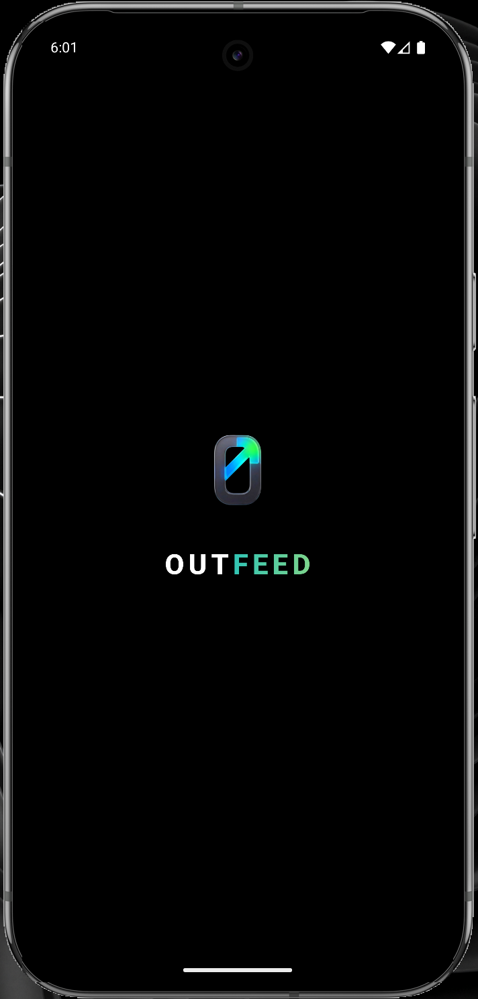
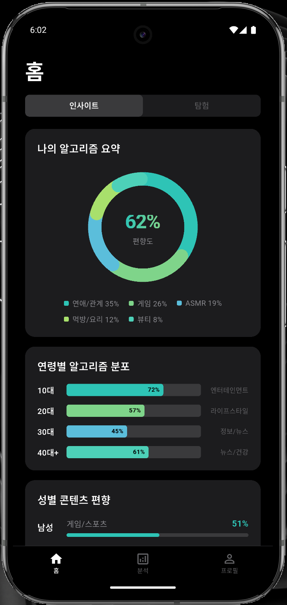
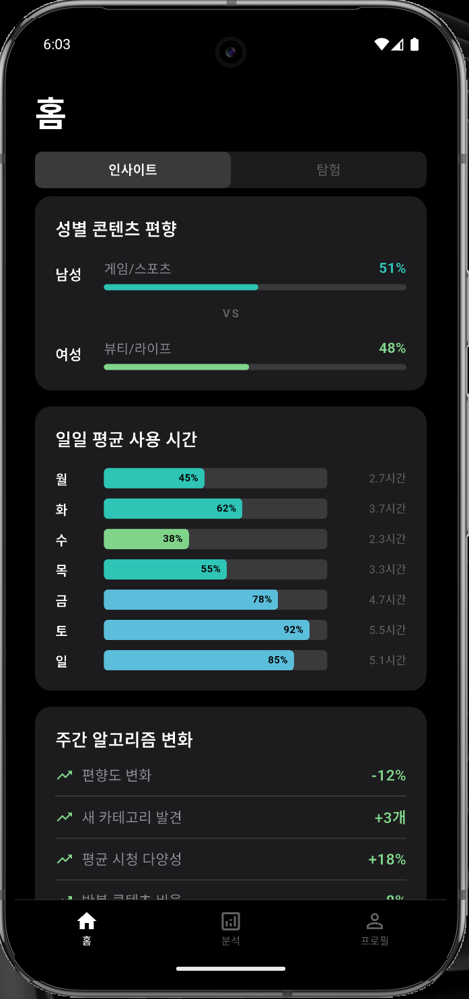
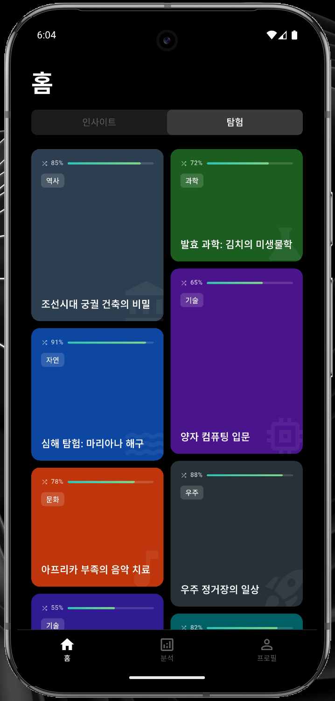
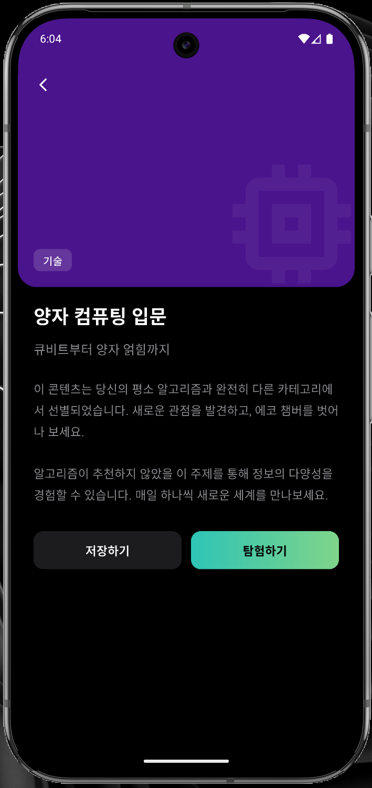
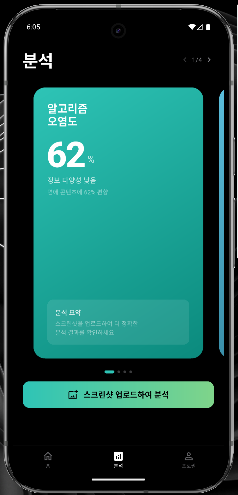
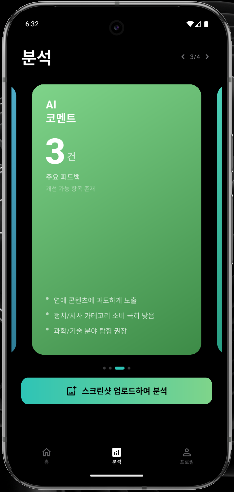
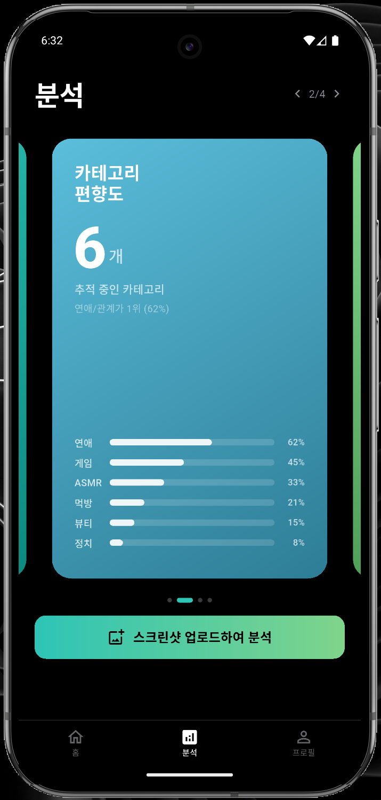
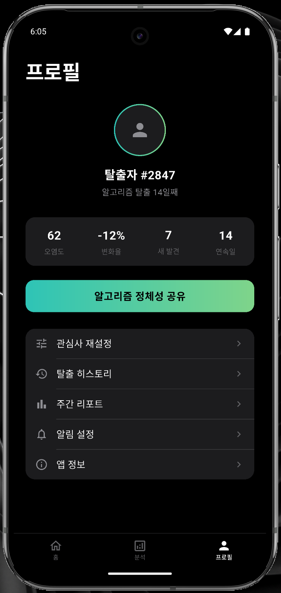

# 미니프로젝트

## 프로젝트명: Outfeed

### 프로젝트 개요

Outfeed는 소셜 미디어 알고리즘에 갇혀 살아가고 있는 현대인들을 위한 서비스입니다. 알고리즘이 추천해주는 컨텐츠만 소비하면서 발생한 정보의 불균형, 확증편향, 양극화된 시각은 현대사회의 새로운 문제로 떠오르고 있습니다. Outfeed는 사용자의 컨텐츠 알고리즘을 분석하여 편향도를 측정하고, 사용자의 알고리즘과 다른 컨텐츠를 제공함으로써 정보의 불균형을 해소하고 더 넓은 시각을 가질 수 있도록 기획되었습니다.

### 프로젝트 아이콘 및 캐치 프레이즈

  
    
  

**Step Out, Explore Outfeed  
바깥의 컨텐츠, 새로운 피드.**

**Symbol:** 무채색 알고리즘의 경계를 깨고 나오는 유채색 화살표  
**Meaning:** Outfeed의 심볼은 익숙한 것에서 낯선 것으로 나아가는 용기를 의미합니다. 우리는 데이터가 정해준 당신이 아닌, 당신이 직접 발견해나갈 당신의 진짜 취향을 지지합니다.

## 주요 기능 설명

### 1. 알고리즘 인사이트

- 나의 알고리즘 요약: 현재 사용자의 알고리즘 편향도와 주요 시청 카테고리 비율을 시각화하여 제공합니다.
- 비교 분석 데이터: 연령별 및 성별 알고리즘 분포 데이터를 통해 대중적인 트렌드와 자신의 위치를 비교할 수 있습니다.
- 사용 패턴 추적: 일일 평균 사용 시간 및 주간 알고리즘 변화 추이를 리포트 형태로 제공합니다.

### 2. 알고리즘 탐험

- 반전 피드 제공: 사용자의 알고리즘과는 거리가 있는 카테고리의 콘텐츠를 그리드 레이아웃으로 배치합니다.
- 피드 상세 보기: 특정 항목 클릭 시 애니메이션을 통해 이미지가 확대되며 상세 정보를 제공합니다.
- 저장 및 탐험: 새로운 분야의 콘텐츠를 저장하거나 해당 서비스로 연결되는 액션 버튼을 포함합니다.

### 3. 알고리즘 AI 분석

- 스크린샷 업로드 분석: SNS 추천 피드 스크린샷을 업로드하면 AI가 카테고리를 분류하여 편향도(오염도)를 측정합니다.
- 카테고리 상세: 추적 중인 카테고리별 비중을 리스트 형태로 상세히 표기합니다.
- AI 맞춤 코멘트: 분석 결과에 따른 구체적인 피드백과 함께 개선 방향을 제시합니다.

### 4. 프로필 관리 및 알고리즘 공유

- 메뉴 리스트: 관심사 재설정, 주간 리포트 등의 설정 메뉴를 제공합니다.
- 알고리즘 정체성 공유: 편향도 분석 결과와 나의 알고리즘 현황을 SNS에 공유할 수 있습니다.

## 실행화면 캡처

  
  
  

  
  
  

  
  
  

## 본인이 구현한 부분

기획 및 브레인스토밍: 앱의 핵심 가치 정의 및 전반적인 컨셉, 색감, 디자인 구체화

프로젝트 명 및 아이콘 디자인: ‘바깥 세상을 향한 탐험’을 상징하는 Outfeed 브랜드 아이덴티티 수립, 알고리즘의 굴레를 의미하는 ‘O’와 이를 탈출하는 화살표 형상의 미니멀리즘 아이콘 디자인.

UI/UX 시스템 설계: 기본적인 UI 뼈대 및 '알고리즘 탈출' 컨셉에 맞춘 주요 기능들과 다크 모드 기반 디자인 및 테마 구축

## AI 활용 여부 및 활용 범위 (Vibe Coding)

앱 아이콘: 직접 그린 앱 아이콘 초안을 가지고 Gemini 3.1과의 협업을 통해 제작

프로젝트 UI: 기본적으로 설계한 UI에 Claude Opus 4.6을 활용한 바이브 코딩으로 제작. 상세 프롬프트를 통해 앱의 의도와 감성을 AI에 전달하고, 생성된 코드를 직접 검토 및 통합하는 방식으로 개발 진행

## 라이센스

이 프로젝트는 MIT License를 따릅니다.

Permission is hereby granted, free of charge, to any person obtaining a copy of this software and associated documentation files (the "Software"), to deal in the Software without restriction, including without limitation the rights to use, copy, modify, merge, publish, distribute, sublicense, and/or sell copies of the Software, and to permit persons to whom the Software is furnished to do so, subject to the following conditions:

The above copyright notice and this permission notice shall be included in all copies or substantial portions of the Software.

THE SOFTWARE IS PROVIDED "AS IS", WITHOUT WARRANTY OF ANY KIND, EXPRESS OR IMPLIED, INCLUDING BUT NOT LIMITED TO THE WARRANTIES OF MERCHANTABILITY, FITNESS FOR A PARTICULAR PURPOSE AND NONINFRINGEMENT. IN NO EVENT SHALL THE AUTHORS OR COPYRIGHT HOLDERS BE LIABLE FOR ANY CLAIM, DAMAGES OR OTHER LIABILITY, WHETHER IN AN ACTION OF CONTRACT, TORT OR OTHERWISE, ARISING FROM, OUT OF OR IN CONNECTION WITH THE SOFTWARE OR THE USE OR OTHER DEALINGS IN THE SOFTWARE.

오픈소스 라이선스 고지 (Open Source Acknowledgments)

- **Flutter SDK**: BSD 3-Clause License
- **Riverpod**: MIT License - 효율적인 상태 관리를 위해 사용되었습니다.
- **Lottie for Flutter**: MIT License - 고품질 네온 애니메이션 구현을 위해 사용되었습니다.
- **Flutter Launcher Icons**: MIT License - 앱 아이콘 자동 생성을 위해 사용되었습니다.
- **Font Awesome Flutter**: MIT License / SIL OFL 1.1
- **Pie Menu & Circular Menu**: MIT License - 직관적인 인터랙션 구현을 위해 사용되었습니다.
- **URL Launcher**: BSD 3-Clause License
